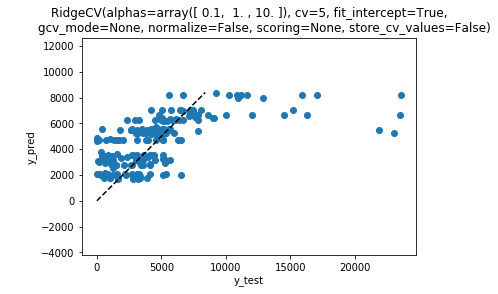

## Predicting Scooter utilization
### [Check out the Github repository here](https://github.com/trevbhatt/predicting_scooter_utilization)
Using Machine learning to improve strategic placement of scooters in Austin, TX.

**Project description:** Now ubiquitous, the electric scooter cruises through bike lanes and sidewalks of every major US city.  In order to stay competitive, operating companies need to ensure their scooters or e-bikes are highly utilized.  They must ensure that their fleets are in place to meet demand.  Using data provided by the city of Austin, TX, I implemented various machine learning strategies to predict optimal fleet distribution.  To jump directly to the Facebook Prophet model, [click here](####Facebook-Prophet)

### Importing and Cleaning the data

Below are the steps I took to import, wrangle, and clean the data.  The Jupyter notebook can be found [here](https://github.com/trevbhatt/predicting_scooter_utilization/blob/master/data_wrangling.ipynb).

1. Imported the data from the csv file downloaded from the [City of Austin](https://data.austintexas.gov/d/7d8e-dm7r)
    * Size: 6,848,950 rows x 16 columns (each row represents a trip)
    * Timeframe: April 2018 to September 2019
    * Columns:
      * ID: A unique ID for each trip (string)
      * Device ID: A unique ID for the device used (string)
      * Vehicle Type: Bicycle or Scooter (string)
      * Trip Duration: time length of trip in seconds (float)
      * Trip Distance: distance traveled in meters (float)
      * Start Time: trip start time (datetime)
      * End Time: trip end time (datetime)
      * Modified Date: datetime at which the record was last modified, typically when the data was extracted (datetime)
      * Month: Month when the trip occurred (integer)
      * Day of week: day of the week when the trip occurred, Sunday = 0 (integer)
      * Council District (Start): City council district in which the trip started (string)
      * Council District (End): City council district in which the trip ended (string)
      * Year: Year when trip occurred (integer)
      * Census Tract Start: Starting Neighborhood GEOID number from US 2010 Census Tract (string)
      * Census Tract End: Ending Neighborhood GEOID number from US 2010 Census Tract (string)
2. Removed 132 empty/none rows.
3. Removed 55,000 “OUT OF BOUNDS” rows
4. Removed 590,000 excessive Trip distance and Trip Duration rows. The vast majority of the data falls within ‘reasonable’ boundaries for trip distance and duration.  However, there are outliers spread to excessive values.  In the 50-bin histograms below, these excessive values tend to only occur a handful of times. It is not possible for a trip to have a negative duration.  Also, trips longer than 12 hours or 50 miles exceed the expected use for these scooters (the best batteries only last about 30 mi). I contacted the data owner, and they told me that they are working with the vendors to understand the causes of the junky data.  Figures 1 and 2 show the data before and after removing these junky rows.
5. Removed Bicycle data, which are out of scope of this analysis.

Figure 1--Trip Duration and Trip Distance frequency before removing outliers

Figure 2--Trip Duration and Trip Distance after removing outliers.  

### Exploratory Data Analysis

#### Usage visualization

The Jupyter notebook for this section can be found [here](https://github.com/trevbhatt/predicting_scooter_utilization/blob/master/data_story.ipynb).

##### Census Tract
Of the data’s 271 census tracts, usage was heavily centered in certain locations, especially the ‘1100’ census tract in the middle of downtown Austin.  Figure 3 shows the comparative dominance of this census tract.  Figure 4 shows a heatmap of census tract usage.

Figure 3 -- Total count of Census Tract Start and End Trips

Figure 4--Heatmap of census tract ridership

Most trips also appear to stay within the central area, with a few exceptions venturing to outer census tract neighborhoods.  For example, Figure 5 shows all trips that originated in CT 1100.

Figure 5--Trip routes originating in census tract 48453001100

##### Time of Day and Day of Week

As you might expect, there are great differences in behavior depending on time of day and day of the week. Figure 6 shows a different sized curve for each day, almost all peaking near 3:00 PM.

Figure 6--Total Daily Ridership per Hour

Most scooter companies require/encourage the chargers to drop off their scooters by 7AM, so this study will focus on the daily variations, counting on deliveries occurring during the early morning valley shared by each day.

#### Bayesian Markov Chain Monte Carlo Data Analysis
The Jupyter notebook for this section can be found [here](https://github.com/trevbhatt/predicting_scooter_utilization/blob/master/statistical_data_analysis.ipynb).

To get an idea of a daily expected number of rides, I attempted to find an initial model to fit the data using a Markov Chain Monte Carlo (MCMC) method.  The data is discrete and may be able to be modeled as a Poisson distribution:

I used MCMC analysis and PyMC3 to generate posteriors for lambda.  Lambda here will represent the expected daily value.

The total number of trips per day (for all Census Tracts) (Figure 7) appears to change at some point in the data.

Figure 7--Number of daily trips in census tract 48453001100

To account for this, we can attempt to understand when this change occurred.  That is, at what point (let’s call it tau, the red line in Figure 7) did the behavior change?

Figure 8 shows the results of the posterior for lambda1, lambda2, and tau for census tract 48453001100.

Figure 8--Posteriors for Lambda before and after a changepoint at tau.

Tau falls solidly at 276 days, which would be the the beginning of January 2019.

The graphs in figure 9 show lambda_1, lambda_2, and tau for the census tracts for which lambda was greater than 50.

Figure 9--Lambda1, Lambda2, and tau for the busiest census tracts.

Tau is in the upper 200s for most of the census tracts, which coincides with the steady increase in scooter popularity in 2019.

The graph of lambda_2 above creates a predicted daily count of trips for the most popular census  tracts (not yet taking into account any seasonality) .

### Machine Learning Analysis

The Jupyter notebook for this section can be found [here](https://github.com/trevbhatt/predicting_scooter_utilization/blob/master/machine_learning_analysis.ipynb).

#### Ridge Regression
Next, I tried using Ridge Regression to predict the number of rides in a census tract on a given day.  I resampled the dataframe by day.  To capture the seasonality of the data, I implemented one hot encoding to expand the date column from 1 to 374 binary columns to represent year, day of year, day of month, and day of week.

On the 48453001100 census tract, the ridge regression had an r2 score (0.355) and a large mean absolute percent error.  The predicted and test values are shown on figure 10.

Figure 10--Ridge Regression Results

#### Batch Gradient Descent
Using the same one hot encoded data, I attempted a batch gradient descent method with learning rate and number of iterations as hyperparameters.  Even with the quickest convergence, shown in Figure 11, the r2 score was a dismal 0.192, with a very large mean absolute error.

Figure 11: Convergence of the batch gradient descent model

####Facebook Prophet
Facebook prophet is a forecasting procedure that makes prediction on time series data.  The major tunable hyperparameters of the Facebook Prophet model are trend, holidays, and seasonality (Letham 7).

##### Trends and Changepoints
The first component is Trend.  Prophet accounts for the way that trends change over time using changepoints.

In Figure 13, the changes in the slope of the trend line correspond to changepoints in the general trend of the daily use data.  These changepoints are highlighted in Figure 12.

Figure 12: Regression line and confidence interval of predictions by Facebook Prophet for 48453001100

##### Holidays and South by Southwest
Facebook Prophet then accounts for holidays. At the beginning of March the city of Austin sees a major influx of visitors attending the popular South by Southwest conference.  Facebook Prophet takes a custom dataframe of major events and US holidays and measures their effect on the prediction.  Their effects can be seen in the holidays graph of Figure 12, notice the largest spike at the beginning of March.

##### Seasonality
Third, Seasonality can be specified yearly, monthly, weekly, and daily.  In this model, weekly and yearly seasonality effects are shown in figure 13.

Not surprisingly, the weekly effect surges on weekend, and there is a general increase in the warm summer months.

igure  13-- Trend, Holidays, and Weekly and Yearly seasonality

#### Business Impact

##### Fleet Usage
The data on which these forecasts are based is the sum total of all scooter operators in Austin. We cannot assume that if we predict 1,000 rides in census tract X, that the operating company using this project would see 1,000 scooters used.  However, these numbers can be used to determine where to place what percentage of the fleet.  In Figure 14 I generated an area plot of the percentage distribution in the top 10 census tracts.

Figure 14--Recommended fleet distribution.

By default, Facebook Prophet predicts with an 80% uncertainty margin. If the provider wanted to adopt a more aggressive approach in some census tracts and a more conservative approach in others, the lower and upper bounds of the uncertainty can be used to calculate the percentage of fleet to use in the census tract.  For example, setting 48453001100 and 48453000601 as aggressive yields a slightly different composition in Figure 15.

Figure 15--Recommended fleet distribution with two ‘aggressive’ estimates

Below are three forecasts for an example date (September 30, 2019) with the same census tracts (48453001100 and 4845300601) set to neutral,  ‘aggressive,’ and ‘conservative.’  Note that setting all census tracts as either aggressive or conservative would not produce meaningful results, because the terms ‘aggressive’ and ‘conservative’ are relative to the other census tracts.

##### Daily Dashboard
Ideally, this system would be integrated with the scooter operator's mobile app for the employees and contractors who place the scooters. However, to illustrate the business application of the model, I made the distribution into a daily dashboard that shows where in the prediction period the forecast was made, the percent distribution and the number of scooters to deploy for a given fleet size. I arbitrarily chose 1200 as the fleet size and made a prediction for September 30, 2019 to generate the dashboard for that day.

### Future Enhancements
Below are some ideas for future enhancements to the model.
1. An hourly model could be used if scooter providers were interested in providing a more dynamically changing fleet distribution.
2. Weather data might improve the predictions of the model.  Weather forecasts could be combined with historical weather data to influence the model as a type of ‘holdiay’ seasonality.

### Resources
P. Bazin, “Linear Regression: Implementation, Hyperparameters, Comparison - Pavel Bazin: Software Engineering, Machine Learning,” Linear Regression: Implementation, Hyperparameters, Comparison, 26-Jan-2018. [Online]. Available: http://pavelbazin.com/post/linear-regression-hyperparameters/. [Accessed: Dec-2019].

Scikit-learn: Machine Learning in Python, Pedregosa et al., JMLR 12, pp. 2825-2830, 2011.

Taylor SJ, Letham B. 2017. Forecasting at scale. PeerJ Preprints 5:e3190v2 https://doi.org/10.7287/peerj.preprints.3190v2
C. Davidson-Pilon, “Probabilistic-Programming-and-Bayesian-Methods-for-Hackers,” GitHub. [Online]. Available: https://github.com/CamDavidsonPilon/Probabilistic-Programming-and-Bayesian-Methods-for-Hackers. [Accessed: Dec-2019].
