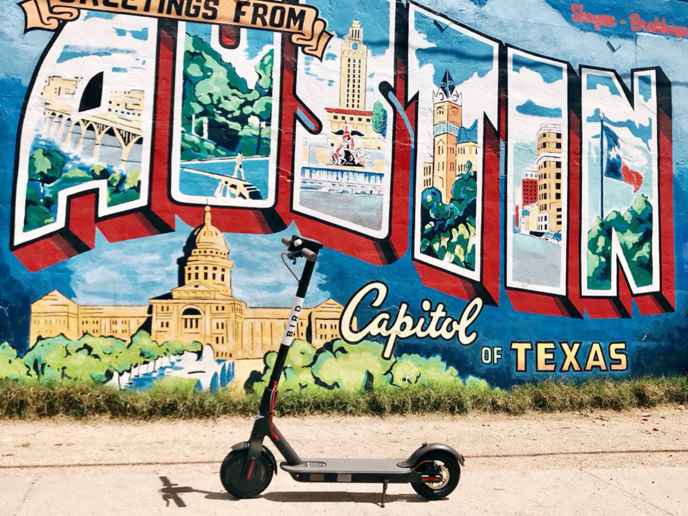

## Predicting Scooter utilization
Using Machine learning to improve strategic placement of scooters in Austin, TX.



**Project description:** Now ubiquitous, the electric scooter cruises through bike lanes and sidewalks of every major US city.  In order to stay competitive, operating companies need to ensure their scooters or e-bikes are highly utilized.  They must ensure that their fleets are in place to meet demand.  Using data provided by the city of Austin, TX, I implemented various machine learning strategies to predict optimal fleet distribution.

### Importing and Cleaning the data

Below are the steps I took to import, wrangle, and clean the data.  The Jupyter notebook can be found here.

1. Imported the data from the csv file downloaded from the City of Austin: https://data.austintexas.gov/d/7d8e-dm7r
    * Size: 6,848,950 rows x 16 columns (each row represents a trip)
    * Timeframe: April 2018 to September 2019
    * Columns:
      * ID: A unique ID for each trip (string)
      * Device ID: A unique ID for the device used (string)
      * Vehicle Type: Bicycle or Scooter (string)
      * Trip Duration: time length of trip in seconds (float)
      * Trip Distance: distance traveled in meters (float)
      * Start Time: trip start time (datetime)
      * End Time: trip end time (datetime)
      * Modified Date: datetime at which the record was last modified, typically when the data was extracted (datetime)
      * Month: Month when the trip occurred (integer)
      * Day of week: day of the week when the trip occurred, Sunday = 0 (integer)
      * Council District (Start): City council district in which the trip started (string)
      * Council District (End): City council district in which the trip ended (string)
      * Year: Year when trip occurred (integer)
      * Census Tract Start: Starting Neighborhood GEOID number from US 2010 Census Tract (string)
      * Census Tract End: Ending Neighborhood GEOID number from US 2010 Census Tract (string)
2. Removed 132 empty/none rows.
3. Removed 55,000 “OUT OF BOUNDS” rows
4. Removed 590,000 excessive Trip distance and Trip Duration rows. The vast majority of the data falls within ‘reasonable’ boundaries for trip distance and duration.  However, there are outliers spread to excessive values.  In the 50-bin histograms below, these excessive values tend to only occur a handful of times. It is not possible for a trip to have a negative duration.  Also, trips longer than 12 hours or 50 miles exceed the expected use for these scooters (the best batteries only last about 30 mi). I contacted the data owner, and they told me that they are working with the vendors to understand the causes of the junky data.  Figures 1 and 2 show the data before and after removing these junky rows.
5. Removed Bicycle data, which are out of scope of this analysis.


Figure 1--Trip Duration and Trip Distance frequency before removing outliers


### 2. Assess assumptions on which statistical inference will be based

```javascript
if (isAwesome){
  return true
}
```

### 3. Support the selection of appropriate statistical tools and techniques


### 4. Provide a basis for further data collection through surveys or experiments

Sed ut perspiciatis unde omnis iste natus error sit voluptatem accusantium doloremque laudantium, totam rem aperiam, eaque ipsa quae ab illo inventore veritatis et quasi architecto beatae vitae dicta sunt explicabo.

For more details see [GitHub Flavored Markdown](https://guides.github.com/features/mastering-markdown/).
