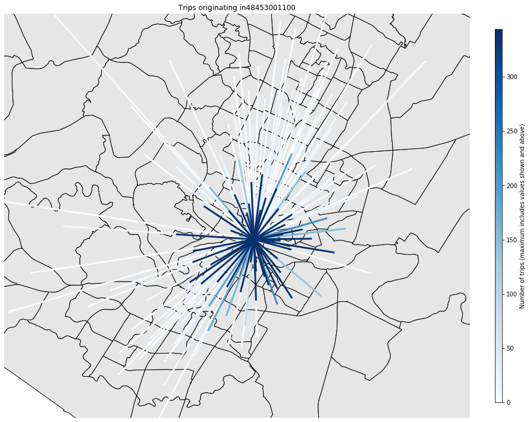
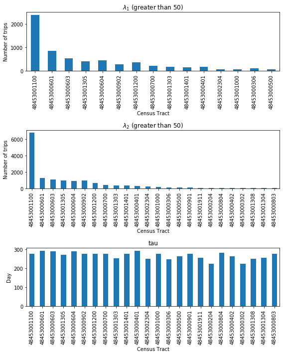

## Predicting Scooter utilization
Using Machine learning to improve strategic placement of scooters in Austin, TX.


**Project description:** Now ubiquitous, the electric scooter cruises through bike lanes and sidewalks of every major US city.  In order to stay competitive, operating companies need to ensure their scooters or e-bikes are highly utilized.  They must ensure that their fleets are in place to meet demand.  Using data provided by the city of Austin, TX, I implemented various machine learning strategies to predict optimal fleet distribution.

### Importing and Cleaning the data

Below are the steps I took to import, wrangle, and clean the data.  The Jupyter notebook can be found [here](https://github.com/trevbhatt/predicting_scooter_utilization/blob/master/data_wrangling.ipynb).

1. Imported the data from the csv file downloaded from the [City of Austin](https://data.austintexas.gov/d/7d8e-dm7r)
    * Size: 6,848,950 rows x 16 columns (each row represents a trip)
    * Timeframe: April 2018 to September 2019
    * Columns:
      * ID: A unique ID for each trip (string)
      * Device ID: A unique ID for the device used (string)
      * Vehicle Type: Bicycle or Scooter (string)
      * Trip Duration: time length of trip in seconds (float)
      * Trip Distance: distance traveled in meters (float)
      * Start Time: trip start time (datetime)
      * End Time: trip end time (datetime)
      * Modified Date: datetime at which the record was last modified, typically when the data was extracted (datetime)
      * Month: Month when the trip occurred (integer)
      * Day of week: day of the week when the trip occurred, Sunday = 0 (integer)
      * Council District (Start): City council district in which the trip started (string)
      * Council District (End): City council district in which the trip ended (string)
      * Year: Year when trip occurred (integer)
      * Census Tract Start: Starting Neighborhood GEOID number from US 2010 Census Tract (string)
      * Census Tract End: Ending Neighborhood GEOID number from US 2010 Census Tract (string)
2. Removed 132 empty/none rows.
3. Removed 55,000 “OUT OF BOUNDS” rows
4. Removed 590,000 excessive Trip distance and Trip Duration rows. The vast majority of the data falls within ‘reasonable’ boundaries for trip distance and duration.  However, there are outliers spread to excessive values.  In the 50-bin histograms below, these excessive values tend to only occur a handful of times. It is not possible for a trip to have a negative duration.  Also, trips longer than 12 hours or 50 miles exceed the expected use for these scooters (the best batteries only last about 30 mi). I contacted the data owner, and they told me that they are working with the vendors to understand the causes of the junky data.  Figures 1 and 2 show the data before and after removing these junky rows.
5. Removed Bicycle data, which are out of scope of this analysis.


Figure 1--Trip Duration and Trip Distance frequency before removing outliers


Figure 2--Trip Duration and Trip Distance after removing outliers.  

### Exploratory Data Analysis

#### Usage visualization

The Jupyter notebook for this section can be found [here](https://github.com/trevbhatt/predicting_scooter_utilization/blob/master/data_story.ipynb).

##### Census Tract
Of the data’s 271 census tracts, usage was heavily centered in certain locations, especially the ‘1100’ census tract in the middle of downtown Austin.  Figure 3 shows the comparative dominance of this census tract.  Figure 4 shows a heatmap of census tract usage.


Figure 3 -- Total count of Census Tract Start and End Trips


Figure 4--Heatmap of census tract ridership

Most trips also appear to stay within the central area, with a few exceptions venturing to outer census tract neighborhoods.  For example, Figure 5 shows all trips that originated in CT 1100.


Figure 5--Trip routes originating in census tract 48453001100

##### Time of Day and Day of Week

As expected, we can see stark differences in behavior depending on time of day and day of the week in Figure 6.


Figure 6--Total Daily Ridership per Hour

Most scooter companies require/encourage chargers to drop off their scooters by 7AM, so this study will focus on the daily variations, counting on deliveries occurring during the early morning valley shared by each day.

#### Bayesian Markov Chain Data Analysis
The Jupyter notebook for this section can be found [here](https://github.com/trevbhatt/predicting_scooter_utilization/blob/master/statistical_data_analysis.ipynb).
To begin we attempt to find an initial model to fit the data and give a general idea of the expected value on a given day.  The model is discrete data that may be able to be modeled as a Poisson distribution:


The parameter lambda can be estimated using Markov Chain Monte Carlo (MCMC) analysis and PyMC3.  In a poisson distribution, lambda can be used to estimate the expected count on a given day.

The total number of trips per day (for all Census Tracts) (Figure 7) appears to indicate that the behavior is not consistent across the entire time that the data was taken.


Figure 7--Number of daily trips in census tract 48453001100

To account for this, we can attempt to understand when this change occurred.  That is, at what point (let’s call it tau, the red line in Figure 7) did the behavior change?

Lambda is a hyperparameter that can be used to represent the expected number of rides before and after Tau.  Using the MCMC, both lambdas and tau can be estimated.  This was performed for each census tract.  Figure 8 shows the results of the posterior for lambda1, lambda2, and tau for census tract 48453001100.


Figure 8--Posteriors for Lambda before and after a changepoint at tau.

Tau of 276 falls at the beginning of January 2019.

The graphs in figure 9 show lambda_1, lambda_2, and tau for the census tracts for which lambda was greater than 50.


Figure 9--Lambda1, Lambda2, and tau for the busiest census tracts.

Tau appears to be in the upper 200s for most of the census tracts with frequent trips.  This coincides with the steady increase in scooter popularity in 2019.

The graph of lambda_2 above creates a predicted daily count of trips for the most popular census  tracts (not yet taking into account weekend vs. weekday) .

###


```javascript
if (isAwesome){
  return true
}
```

### 3. Support the selection of appropriate statistical tools and techniques


### 4. Provide a basis for further data collection through surveys or experiments

Sed ut perspiciatis unde omnis iste natus error sit voluptatem accusantium doloremque laudantium, totam rem aperiam, eaque ipsa quae ab illo inventore veritatis et quasi architecto beatae vitae dicta sunt explicabo.

For more details see [GitHub Flavored Markdown](https://guides.github.com/features/mastering-markdown/).
